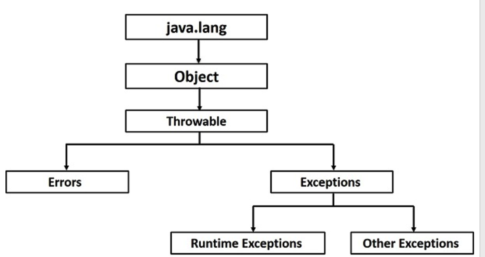

# Java Exception

[TOC]

参考：[java-exceptions](https://www.tutorialspoint.com/java/java_exceptions.htm)


## 异常分类

* *checked exceptions* : occurs at the compile time. 需要处理的异常

  compile time exceptions.

  例如：FileNotFoundException

* *unchecked exceptions* : occurs at the time of execution. 

  runtime exceptions. 程序bugs ,例如逻辑错误或者使用了不正确的api.

  runtime exceptions are ignored at the time of compilation.

  例如：ArrayIndexOutOfBoundsException

* *errors* : 例如stack overflow.

## Exception Hierarchy




[java-built-in-exceptions](https://www.tutorialspoint.com/java/java_builtin_exceptions.htm)


## tips

#### throw和throws的区别

throw is used to invoke an exception explicitly.

throws is used to postpone the handling of a checked exception.

例如：

```java
 public void queryName() throws xxxException{
	//method implemention
   throw new xxxException();
}
```

####  自定义exceptions (user-defined exceptions)

要写一个checked exception，需要extend Exception class.

要写一个runtime exception, 需要extend the RuntimeException class.


